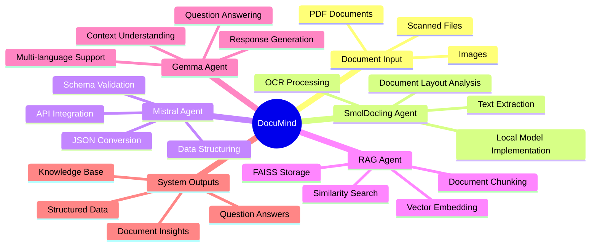

# DocuMind: Agent-based Document Processing System

An intelligent document processing system using multiple AI models in a pipeline architecture to extract, structure, store, and query information from documents.

## Overview

DocuMind uses four specialized agents working together:

1. **SmolDocling Agent**: OCR and raw data extraction from documents using SmolDocling-256M-preview
2. **Mistral Agent**: Data structuring using Mistral API
3. **RAG Agent**: Vector storage and retrieval of document information
4. **Gemma Agent**: Analysis and question answering with Gemma 3

## Workflow Diagram



## Data Flow Process

```
┌─────────────┐     ┌────────────────┐     ┌──────────────────┐     ┌────────────────┐     ┌─────────────────┐
│  Document   │     │  SmolDocling   │     │     Mistral      │     │      RAG       │     │      Gemma      │
│   Input     │────▶│  OCR & Layout  │────▶│  Structuring     │────▶│  Vector Store  │────▶│  Q&A Response   │
│  (PDF/IMG)  │     │  (Local Model) │     │  (API-based)     │     │  & Retrieval   │     │                 │
└─────────────┘     └────────────────┘     └──────────────────┘     └────────────────┘     └─────────────────┘
                            │                       │                        │                      │
                            ▼                       ▼                        ▼                      ▼
                     ┌────────────┐         ┌────────────┐           ┌────────────┐        ┌────────────┐
                     │ Raw Text & │         │ Structured │           │ Retrieved  │        │   Final    │
                     │   Layout   │         │    JSON    │           │  Context   │        │  Response  │
                     └────────────┘         └────────────┘           └────────────┘        └────────────┘
                            │                       │                        │                      │
                            └───────────────────────┴────────────────────────┴──────────────────────┘
                                                          │
                                                          ▼
                                                  ┌─────────────────┐
                                                  │   Cache System  │
                                                  │  (Reuse Results)│
                                                  └─────────────────┘
```

## Requirements

- Python 3.9+
- Dependencies listed in `requirements.txt`
- Optional: GPU with CUDA for faster processing
- API keys:
  - Mistral API key for data structuring
  - Google API key for Gemma 3 integration

## Installation

1. Clone this repository
2. Install dependencies:
   ```
   pip install -r requirements.txt
   ```
3. Create a `.env` file with the necessary API keys:
   ```
   MISTRAL_API_KEY=your_mistral_api_key
   GOOGLE_API_KEY=your_google_api_key
   ```
4. Download the SmolDocling model for local usage:
   ```
   python -c "from transformers import AutoModelForVision2Seq, AutoProcessor; model = AutoModelForVision2Seq.from_pretrained('google/smoldocling-256M-preview'); processor = AutoProcessor.from_pretrained('google/smoldocling-256M-preview'); model.save_pretrained('./models/smoldocling'); processor.save_pretrained('./models/smoldocling')"
   ```

## Usage

### Command Line Interface

```bash
# Process a document
python main.py --file path/to/document.pdf

# Process a document and ask a question
python main.py --file path/to/document.pdf --question "What is the total tax amount?"

# Use GPU acceleration
python main.py --file path/to/document.pdf --question "What is the total tax amount?" --gpu
```

### Python API

```python
from main import DocuMindPipeline

# Initialize the pipeline
pipeline = DocuMindPipeline()

# Process a document and ask a question
file_path = "path/to/document.pdf"
question = "What is the total tax amount?"
answer = pipeline.answer_question(file_path, question)
print(answer)
```

## Project Structure

- `main.py`: Main pipeline handling the flow between agents
- `agents/`: Individual agent implementations
  - `smol_agent.py`: OCR agent using locally deployed SmolDocling
  - `mistral_agent.py`: Structuring agent using Mistral API
  - `rag_agent.py`: Storage and retrieval agent using RAG
  - `gemma_agent.py`: Analysis and answering agent using Gemma 3
- `utils/`: Utility functions
  - `file_utils.py`: File handling utilities
- `example.py`: Example usage
- `models/`: Directory for locally stored models
  - `smoldocling/`: Local storage for SmolDocling model files

## Extension Points

The modular architecture allows for various extensions:

1. **Additional Agents**
   - Add specialized agents for specific document types
   - Implement domain-specific processing agents

2. **Alternative Models**
   - Replace models with alternatives (e.g., Claude for structuring)
   - Add support for different embedding models in the RAG agent

3. **UI Integrations**
   - Web interface with Flask/Streamlit
   - Desktop application with PyQt

4. **Output Formats**
   - Support more structured data formats (XML, CSV)
   - Add export functionality to databases


## Contributing

Contributions are welcome! Please follow the [contribution guidelines](CONTRIBUTING.md) and open an issue or pull request for any enhancements or fixes.

## Acknowledgments

- [SmolDocling](https://github.com/google/smoldocling) for OCR and document parsing

- [Mistral](https://huggingface.co/mistralai/Mistral-7B-Instruct-v1.0) for document structuring

- [FAISS](https://github.com/facebookresearch/faiss) for vector storage and retrieval

- [Gemma 3](https://github.com/google/gemma3) for analysis and question answering

- [Claude](https://github.com/claudeai/claude) for alternative structuring

# DocuMind Pipeline

DocuMind is a modular pipeline designed to process documents and answer questions. It leverages various agents to handle different stages of the document processing workflow.

## Overview

The pipeline consists of the following agents:

1. **Smol Agent**: OCR and document parsing using SmolDocling.
2. **Mistral Agent**: Structuring the document using Mistral.
3. **RAG Agent**: Storage and retrieval of document embeddings.
4. **Gemma Agent**: Analysis and answering of questions.

## Usage

To use the pipeline, follow these steps:

1. Initialize the pipeline. This will set up the agents and their dependencies.
2. Process a document by calling the `process_document` method.
3. Answer a question by calling the `answer_question` method.

```python
from main import DocuMindPipeline

# Initialize the pipeline
pipeline = DocuMindPipeline()

# Process a document
file_path = "path/to/document.pdf"
pipeline.process_document(file_path)

# Answer a question
question = "What is the total number of pages in the document?"
answer = pipeline.answer_question(question)
print(answer)
```

## Customization

You can customize the pipeline by adding or modifying agents. For example, to add a specialized agent for a specific document type, you can create a new agent class and register it with the pipeline.

```python
from main import DocuMindPipeline

# Custom agent class
class CustomAgent:
    def __init__(self, pipeline):
        self.pipeline = pipeline

    def process_document(self, file_path):
        # Custom processing logic
        pass

    def answer_question(self, question):
        # Custom answering logic
        pass

# Register the custom agent with the pipeline
pipeline = DocuMindPipeline()
pipeline.register_agent("custom", CustomAgent)

# Process a document using the custom agent
file_path = "path/to/document.pdf"
pipeline.process_document(file_path)

# Answer a question using the custom agent
question = "What is the answer to the question?"
answer = pipeline.answer_question(question)
print(answer)
```

## Integration

You can integrate the pipeline with other applications by using the `DocuMindPipeline` class. For example, you can use it in a web application or a desktop application.

```python
from main import DocuMindPipeline

# Initialize the pipeline
pipeline = DocuMindPipeline()
```

## License

Apache License 2.0